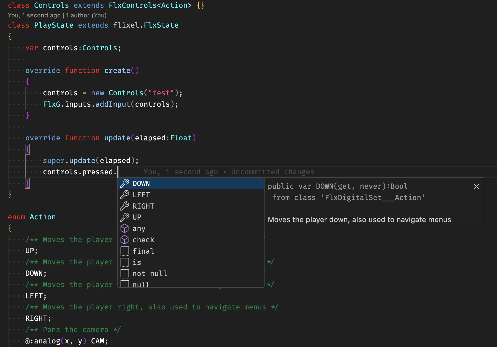

# FlxControls
A simplified multi-device input manager tools for HaxeFlixel



Allows you to easily define all possible player actions, whether the action represents digital or analog data and what device inputs each action is mapped to, by default. As shown above, extending FlxControls causes macros to generate handy fields for each action.

## Setup

  1. Install flixel-controls from haxelib.
     
     Command Line:
     ```haxelib install flixel-controls```
  2. Include flixel-controls in your project.xml:  
     
     ```xml
     <haxelib name="flixel-controls"/>
     ```
     
## Digital Actions
Using the ["Bare" sample](samples/Bare/source/Action.hx) as an example, `UP`, `DOWN`, `LEFT` and `RIGHT` are digital actions, as they are tied to things like gamepad buttons or keyboard keys. Digital actions create fields which can be used to check the status of actions, like so:
```hx
// same as controls.checkDigital(DOWN, PRESSED);
controls.pressed.DOWN
// same as controls.checkDigital(DOWN, JUST_PRESSED);
controls.justPressed.DOWN
// same as controls.checkDigital(DOWN, RELEASED);
controls.released.DOWN
// same as controls.checkDigital(DOWN, JUST_RELEASED);
controls.justReleased.DOWN
```

### Repeat Events
In addition to the typical digital input states, above, there is also a 5th event type called "repeat". It is always true when the action is just pressed, but when held it will be true every 0.1 seconds (or whatever interval you decide). This is common behavior for menu navigation.
```hx
// true every 0.1s when held
controls.repeat().DOWN

// true every 0.1s when held
controls.repeat(0.25).UP
```

Additionally there's custom `waitAndRepeat` events, which are true when just pressed, and when held for some time, will repeat at some frequency. This behavior is common for text input.
```hx
// By defualt, the initial wait is 0.5 seconds and the frequency is 0.1 seconds
controls.waitAndrepeat().LEFT

// The initial wait is 0.3 seconds and the frequency is 0.15 seconds
controls.waitAndrepeat(0.30, 0.15).RIGHT
```

## Analog actions
Actions can be tied to analog inputs as well, such as a joystick, a trigger or the mouse position. Using the ["Bare" sample](samples/Bare/source/Action.hx) as an example, once again, `MOVE`, `LEFT_TRIGGER` and `RIGHT_TRIGGER` are analog actions. Their values can be accessed like so:
```hx
// will be a value from 0.0 to 1.0
controls.TRIGGER_LEFT.value
controls.TRIGGER_RIGHT.value
// will be a value from -1.0 to 1.0 from the gamepad's analog stick,
// but can be higher or lower by moving the mouse fast enough
controls.MOVE.x
controls.MOVE.y
```

### Creating Analog Actions from Digital Inputs
Four digital inputs can be used to create a 2D analog input, allowing keys like W,A,S and D to function similarly to a gamepad's joystick, where pressing them can set the corresponding x and y values to `-1` or `1`. Similarly, 2 digital inputs can create a 1D analog input. Check out the ["FlxCamera" demo](samples/FlxCamera/source/input/PlayerControls.hx#L44-L50) for an example.

### Creating Digital Sub-actions from Analog Actions
Just as 4 digital directional inputs can be used to create a 2D analog action, All 2D analog actions have 4 directional sub-actions. For instance say the action `MOVE` is tied to a gamepad's joystick, when the stick is moved forward (making the `y` value postive) `controls.MOVE.pressed.up` will be true. Similarly, 1D actions will have `up` and `down` sub-actions.

Just like digital actions, these directional sub-actions have `pressed`, `released`, `justPressed`, `justReleased` and `holdRepeat` fields

## Setuping up the Default Input Mappings
There are two ways to setup your control's default mapping: 1. Add the meta `@:inputs([...])` to each value of your enum action. Each with an array of different inputs. Check out the ["Bare" sample](samples/Bare/source/Action.hx) for an example 2. In your class extending FlxControls, define `function getDefaultMappings():ActionMap<MyAction>` and have it return a map that links actions to an array of inputs. Check the ["FlxCamera" sample](samples/FlxCamera/source/input/PlayerControls.hx#L41-L52) for an example.

### Defining Input Arrays for Mappings
The aforementioned input arrays are very flexible, you can list any `FlxKey`, `FlxGamepadInputID`, `FlxMouseButtonID` or `FlxVirtualPadInputID`. Here are some examples for each input device:
- Keyboard: Can specify key inputs via `FlxKey.A`, or unique keys like `ENTER` or `H` can be used, unqualified, since there is no H input on any other device. Using a `FlxKey` directly - like above - is short-hand for `Keyboard(Lone(A))`, which is also acceptible. 2D multi-key analog inputs can be added via `Keyboard(Multi(W, S, D, A))`, though you can shorten this by using [import aliases](samples/FlxCamera/source/input/PlayerControls.hx#L6). There are also helpers for common directional keys, like `WASD` and `Keyboard(Arrows)`
- Gamepad: Can specify gamepad inputs via `FlxGamepadInputID.A`, or unqique things like `DPAD_UP` can be used, unqualified. Using a `FlxGamepadInputID` directly - like above - is short-hand for `Gamepad(Lone(A))`, which is also acceptible. 2D multi-button analog inputs can be added via `Gamepad(Multi(Y, A, B, X))`, though you can shorten this by using [import aliases](samples/FlxCamera/source/input/PlayerControls.hx#L9). There are also helpers for common directional buttons, like `DPAD` and `FACE` (AKA: ABXY buttons)
- Mouse: Can specify button inputs via `FlxMouseButtonID.LEFT`, or `MIDDLE` can be used, unqualified. Using a `FlxMouseButtonID` directly - like above - is short-hand for `Mouse(Lone(LEFT))`, which is also acceptible. Analog mouse inputs are specified via `Mouse(Position())`, `Mouse(Motion())`, `Mouse(Drag())` or `Mouse(Wheel())`. Some of these allow you to specify a single axis (2D is the default) and a scale, in addition to other properties
- Virtual Pad: Virtual pad inputs behave identical to Keyboard inputs, but with `FlxVirtualPadInputID` values rather than `FlxKey`. It also has a helper for analog `Arrows`

## Changing Input Mappings at runtime
`FlxControls` supports re-mapping inputs using the `add` and `remove` methods, which take the target action and an input which is specfied the same way they were in the default map. Currently, there is no built-in save system or helper for re-mapped controls. You'll need to make that yourself as well as any UI for allowing the user to remap controls, but both of these are planned.

## Multiple Gamepads
You can make multiple instances of `FlxControls` where each instance uses a different gamepad. By default `FlxControls` uses all connected gamepads. Use `setGamepadID(FIRST_ACTIVE)` or `setGamepadID(myGamepad.id)` to use a single gamepad. Currently, there is no way to make the keyboard and/or mouse only work for one instance without specifically removing each input of that device, though, a per device toggle is planned.

## Displaying Input Labels to the User
To get a list of strings that represent each input tied to a specific action, use `listInputLabelsFor(MyAction)` and if desired, specify a device to limit this list. To get the labels for whichever device is actively being used, use `controls.listInputLabelsFor(MyAction, controls.lastActiveDevice)`. For gamepads the label returned will actually be the specific label of that gamepad model, not just the generic gamepad input id. Non-english keyboards will return the label of whatever key is located there on the English equivalent. In the future, it's planned to actually get the label of that key based on your keyboards layout. For multi input analog inputs a string containing all the inputs is returned.

If using Flixel 5.9.0, there is a `listMappedInputsFor` method, which, instead of returning labels, it returns an enum containing every possible input from every possible device. For gamepads it will use identifiers such as `WII_REMOTE(A)` or `PS4(SQUARE)`. For keyboard, The Result looks very similar to the input mappings passed in, for "Multi button" analog inputs like `Face`, the result is something like:
```hx
Gamepad(Multi([PS4(TRIANGLE), PS4(X), PS4(CIRCLE), PS4(SQUARE)]))
```
These ids can be used to create custom labels or display a specific image of that input.

## Action Groups
Action groups allow you to specify which actions cannot share inputs. This is useful for actions with opposing purposes, like accept vs cancel or up vs down. This can be very important for games that let the user remap controls.

### Creating Groups
Simply call `addGroup` to create a new action group, alternatively you can override the `initGroups` method in your extending controls class to set the groups directly. The last and perhaps easiest way to assign groups is to use the `@:group("tag-name-here")` tag on your Action enum fields.

### Checking for Group Conflicts
To get a list of every conflict in the current setup, use the `checkAllGroupConflicts` method, or the `checkGroupConflicts` method for checking a single group. If possible conflicts should be prevented before being added via the `listConflictingActions` or `addIfValid` methods. By design, the `add` method does nothing to prevent conflicts, and the default mappings are not checked for validity, but you can use the compile flag `FlxControls.checkConflictingDefaults` to enable this, meaning conflicts with the default mapping will throw an error at runtime.

### Thanks
- The FlxControls logo uses [Kenney](https://kenney.nl/)'s [Input Prompts](https://kenney.nl/assets/input-prompts), thanks Kenney!
- FlxControls is build on top of [FlxActions](https://haxeflixel.com/demos/FlxAction/) and obviously uses Flixel

## To Dos
- [Schema for saving input mappings](https://github.com/Geokureli/FlxControls/issues/7)
- [Way to disable FlxControl instances and specific input devices for specific instances](https://github.com/Geokureli/FlxControls/issues/6)
- ~~[Allow custom holdRepeat timings (specifically allow multiple timings to exists at once)](https://github.com/Geokureli/FlxControls/issues/8)~~
- [Example input remapping UI](https://github.com/Geokureli/FlxControls/issues/9)
- [Add way to get key labels for non-english keyboards](https://github.com/Geokureli/FlxControls/issues/10)
- [Map each `FlxControlMappedInput` to an image in Kenney's input prompts](https://github.com/Geokureli/FlxControls/issues/11)
- [Add custom digital/analog action](https://github.com/Geokureli/FlxControls/issues/3)
- [Add contextual actions](https://github.com/Geokureli/FlxControls/issues/12)
- [Input buffering](https://github.com/Geokureli/FlxControls/issues/13)
- ~~Add groups~~
